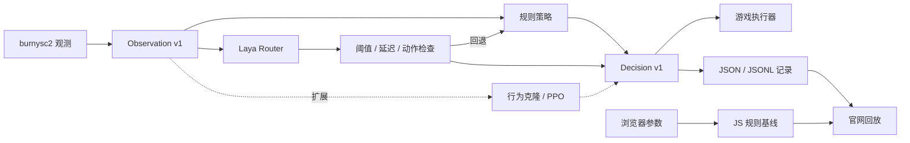

# Yuri 0.2 开发设计与交付计划

更新：2026-09-28。运行环境：WSL Ubuntu，`/home/tsonglew/yuri`。

## 1. 目标与状态

将旧版星际争霸 II 机器人升级为宏观决策实验平台：规则建立基线，Laya 提供语义决策，后续接入行为克隆、PPO 等方案。官网目标为 `https://tsonglew.github.io/yuri/`，包含可交互沙盘和真实记录回放。

不宣称 Laya 已学会星际争霸，不沿用旧版 95% 胜率，不把规则输出冒充模型推理；动作置信度也不是获胜概率。

| 交付 | 实现位置 | 当前边界 |
| --- | --- | --- |
| 局面 / 决策协议 | contracts.py | 版本、数值、动作合法性校验 |
| 规则策略 | policies.py | 无模型依赖，可离线运行 |
| Laya 策略 | policies.py | 真实 Router API；替身测试，实际权重待验收 |
| 异步调度 | runner.py | 单在途任务，晚到或紧急状态回退 |
| 游戏适配 | game.py | 实验性神族运营与执行，未实战验证 |
| 官网与回放 | site/ | 规则实时计算，模型结果导入回放 |
| 依赖升级 | pyproject.toml / uv.lock | Python 3.12，新入口不依赖旧 TF |
| 发布 | .github/workflows/pages.yml | 仓库需开启 Pages / GitHub Actions |

## 2. 旧代码诊断与迁移原则

旧链路为 `main.py → GameLauncher → MainBot → AttackChoiceBot → AttackBot`。规则负责运营，CNN 对绘制的 176×200 图像分类，使用胜局动作作为标签。训练代码属于监督分类，不是完整 DQN。

问题包括：Python 3.6 / TF GPU 1.11 / Keras 2.2.4 过时；macOS 数据软链接失效；None 动作混入训练集；四分类与五项攻击函数不一致；Full 分支通道和返回值不一致；固定图像尺寸；缺乏自动测试。

迁移采用并行新入口：`src/yuri_next` 是受支持运行时，根目录旧 main、basebots、models、trainers、Pipfile* 保留作历史参考，不能视作已兼容 Python 3.12。新安装只使用 uv，不运行 pipenv。新运行时不读取旧模型和软链接。若后续复用旧 npy，单独编写受信任数据转换工具，不默认对任意文件开启 pickle。

## 3. 架构与职责



策略只选择宏观动作，执行器负责单位命令，运营脚本负责工人、人口、科技、生产、扩张。策略不得直接操作客户端，前端不包含模型密钥或隐式本机服务调用。

```text
src/yuri_next/
  contracts.py    Observation / Decision / Policy / Action
  policies.py     RulePolicy / LayaPolicy / 注册表
  runner.py       单在途后台推理
  game.py         SC2 观测、运营、执行与轨迹
  cli.py          decide / game 命令
examples/        离线局面
tests/           契约、回退、规则一致性测试
site/            官网、交互沙盘、回放、在线文档
scripts/         站点构建与校验
docs/            开发设计与验收计划
```

## 4. 数据协议

### Observation v1

| 字段 | 范围 | 语义 |
| --- | --- | --- |
| schema_version | 整数 1 | 不兼容修改升版本 |
| army_supply | 非负数 | 可调动己方战斗部队人口 |
| enemy_army_supply | 非负数 | 最近可见敌战斗人口；不是敌方总兵力 |
| base_threat | 0–1 | 基地附近可见敌战斗人口 / 12，截断为 1 |
| army_health | 0–1 | 部队生命与护盾总和 / 对应上限；空军队为 1 |
| intel_age_seconds | 非负数 | 距看到敌战斗部队的游戏秒数 |
| minerals / gas | 非负数 | 可用资源 |
| supply_left | 非负数 | 剩余人口 |
| game_time_seconds | 非负数 | 游戏时间，与墙钟推理延迟区分 |
| enemy_visible | 布尔 | 当前是否看见敌战斗部队 |

拒绝 NaN、无穷、负数、数字字符串。无视野不能视为敌方没有军队。初版观测器只保存最近一次可见兵力，未来需要敌军 tag 记忆、时间戳与死亡确认。

### Action v1

| ID | 语义 | 初版执行 |
| --- | --- | --- |
| hold | 集结 | 基地朝地图中心方向附近 attack-move |
| defend | 防守 | 基地附近敌军，否则返回基地 |
| attack | 进攻 | 已知敌建筑，否则敌方起点 |
| retreat | 撤退 | move 回己方基地 |
| scout | 侦察 | 一名战斗单位前往敌方起点 |

无战斗部队时只允许 hold。初版管理追猎者、虚空辉光舰、狂热者，不实现复杂微操。hold 指集结，非游戏 hold-position 技能。

### Decision v1 与轨迹

字段：`action`、`requested_policy`、`executed_policy`、`reason`、`latency_ms`、可空 `confidence`、`fallback_reason`、`model`、`schema_version`。

规则不生成置信度。Laya 原因只描述来源，不虚构推理解释。请求 laya 但实际 rules 时必须显示回退。墙钟延迟包括首次模型加载。

记录外层：`schema_version`、`source`、`observation`、`decision`。异步结果额外记录 `inference_observation`，避免把执行时局面误当成推理输入。页面展示执行时局面。JSON 用于单条 / 数组，JSONL 用于逐决策轨迹。

## 5. Laya 实现规范

版本固定 `laya==0.3.21`，已核对发布 wheel 中 Router.predict 和置信度代码。采用英文结构化状态与 `model="english"`，避免自动路由变化。

1. 排序序列化 Observation，候选仅包含合法动作。
2. 构造 `type="choice"` 的 action 问题，说明敌军人口只是已知下界。
3. 一次延迟加载 Router 并复用；不在每 tick 加载权重。
4. 调用 `Router.predict(state, questions, model=..., min_confidence=...)`。
5. 读取 `answers.action.choice` 和 `answer_confidence`。
6. 缺字段、非法动作、无效数值、低置信度、异常、晚到结果都回退规则，保留原因。

默认阈值 0.65，结果预算 1500 ms，均为待校准工程初值。模型置信度不是策略正确率或获胜概率。

实战使用单工作线程，至多一个在途任务。模型加载或推理期间，游戏继续执行规则。已有任务未完成时不追加无限队列。紧急防守 / 撤退覆盖旧结果。预算检查拒绝晚到结果，但不能中断原生 GPU 调用；线程关闭也不保证进程立即退出。生产化应使用独立进程、硬超时、预热、熔断与重启。

首次权重下载可能触发预算回退。离线验收可调大预算。包版本已锁定，但权重 revision 尚未锁定；真实验证时记录模型 revision / 校验值、设备、冷 / 热延迟，再固定权重。不能把替身测试当成真实模型验收。

## 6. 依赖升级矩阵

| 原组件 | 新方案 | 理由 |
| --- | --- | --- |
| Python 3.6 | 3.12.x | 当前 WSL 已有，先收窄支持矩阵 |
| Pipenv | uv + pyproject + uv.lock | extras 与可复现安装 |
| sc2 0.9.0 | burnysc2 7.x，核查 7.3.0 | 现代 API 与 WSL 支持 |
| TF GPU 1.11 / Keras 2.2.4 | 新入口移除 | Laya 按需使用 PyTorch |
| NumPy 1.15 | 按新游戏 / 模型依赖解析 | 核心不引入数组框架 |
| OpenCV 3.4 | 新入口移除 | 结构化状态与 SVG 展示 |
| PyYAML | 核心不需要 | JSON / CLI 配置 |
| 无前端 | 原生 HTML / CSS / ES Modules | 静态站点，无 npm 构建依赖 |

安装以 uv.lock 为准；核心无运行时第三方依赖，game / laya 分开启用。升级后重新锁定和测试，不全局更新 pip 环境。PyTorch CPU / CUDA 发行包需根据目标设备选择，默认依赖可能较大；解析成功不等于 CUDA 可用。

## 7. WSL 操作手册

以下均在 Ubuntu 的项目目录执行：

```bash
cd /home/tsonglew/yuri
uv sync --locked
uv run --locked pytest -q
uv run --locked yuri decide --policy rules \
  --state examples/observation.json --output artifacts/rules.json

# 模型依赖与真实推理；首次下载权重
uv sync --locked --extra laya
uv run --locked --extra laya yuri decide --policy laya \
  --state examples/observation.json --budget-ms 120000 \
  --output artifacts/laya.json

# 游戏与 Laya 对局
uv run --locked --extra game yuri game --policy rules --map AbyssalReefLE
uv run --locked --extra game --extra laya yuri game --policy laya --map AbyssalReefLE
```

检查 executed_policy。即使 CLI 正常退出，也可能执行了规则回退。使用 `uv run` 时保留需要的 extra，避免同步环境时移除可选依赖。

Windows 调用示例：

```powershell
wsl.exe -d Ubuntu -- bash -lc 'cd /home/tsonglew/yuri && uv run --locked yuri decide --policy rules --state examples/observation.json'
```

不要使用 Windows Python 安装 WSL 依赖。新包安装不再需要从父目录执行 `python -m yuri.main`。

### 游戏环境

优先 Windows SC2 + WSL Python。burnysc2 默认检测 WSL 并使用 Windows 游戏；WSL2 可按官方文档设置 SC2CLIENTHOST / SC2SERVERHOST，结合实际网络模式测试，不把某台机器 IP 固定入仓库。必要时配置 SC2PATH。

也可安装 Linux headless SC2，设置 `SC2_WSL_DETECT=0`，适合批量评估。两种方式均需地图和兼容游戏版本。当前未确认本机游戏安装，CLI 直接保留上游启动错误；后续补充独立 doctor 命令。

## 8. 官网和交互验收

目标 `https://tsonglew.github.io/yuri/`，所有资源用相对 URL，适配子路径，不添加 CNAME。

- 五个场景：优势、基地威胁、低血撤退、陈旧情报、开局。
- 五个滑块：双方兵力、健康、威胁、情报年龄；实时规则计算。
- SVG 地图显示基地、单位示意与动作方向，明确非游戏画面。
- 展示来源、理由、命中优先级和实测耗时，不虚构置信度。
- 导出 JSON，导入 JSON / 数组 / JSONL；逐条时间线回放。
- 回放冻结输入，避免修改状态后继续显示旧模型结果。
- 最多 10 MB / 10000 条记录，校验协议 / 数值 / 动作。
- 文件仅在浏览器解析，不上传；格式合法不证明记录真实性。
- 官网不运行模型，不自动连接访客本机端口。

```bash
python3 scripts/build_site.py
python3 scripts/check_site.py
python3 -m http.server 8765 --directory _site --bind 127.0.0.1
```

后续在线推理需要独立 HTTPS 服务：鉴权、CORS、限流、队列、预算和明确的在线状态。静态 GitHub Pages 本身不能承载 Python 推理。

## 9. GitHub Pages 发布和回滚

1. 功能分支运行 CI 后合入默认分支 master；工作流同时兼容 main。
2. Settings → Pages → Source 选择 GitHub Actions。
3. 默认分支 push 或 workflow_dispatch 运行 Pages。
4. 构建校验静态资源，只上传 `_site`；deploy 使用 pages:write、id-token:write 与 github-pages 环境。
5. 最终检查部署 URL、首页、文档、模块 MIME、子路径与导入导出，再声明上线成功。

不改个人根站仓库。项目站点自动位于 /yuri/；若根站已有自定义域名，最终地址以 Pages 输出为准。产物不包含仓库源码、模型、日志、虚拟环境和软链接。

站点回滚：回退错误提交并重新发布；策略回滚：`--policy rules`；依赖回滚：恢复旧 pyproject / uv.lock 后 locked sync。无需强推历史。

## 10. 可扩展策略

实现 `Policy.decide(Observation) -> Decision`，使用 `register_policy(name, factory)` 注册。当前 CLI 显式列出 rules / laya，新增策略需同步更新命令选项、extra、失败行为和测试，不自动加载不受控插件。

推荐顺序：

1. 规则 v2：敌军记忆、兵种克制、目标选择、动作迟滞。
2. 行为克隆：专家 / 筛选规则轨迹训练小 MLP；按完整对局划分数据集防止相邻帧泄漏。
3. Laya 微调：领域标签、阈值校准、未见地图与对手评估。
4. PPO：封装 reset / step / episode、奖励、动作 mask、固定决策周期；游戏运行成本单独评估。
5. 混合策略：低频战略模型与高频规则 / 微操，共用记录协议。

新增策略需明确 ID、配置、依赖、合法动作、延迟预算、回退、模型许可证与评估结果。

## 11. 测试与评估

离线检查：观察值边界；规则优先级；Laya 正常 / 低置信度 / 缺字段 / 非法动作 / 加载失败 / 晚到；调度单在途与旧结果覆盖；Python / JS 共用规则场景；五场景与滑块、重置、导入导出、坏文件；桌面 / 手机 / 键盘 / 控制台；站点子路径与构建产物白名单。

实机验收（尚未完成）：

1. 规则机器人完成一局并导出轨迹。
2. 真实 Laya 权重输出 executed_policy=laya，记录 revision / 设备。
3. 人为制造延迟或低置信度，游戏继续且回退可追溯。
4. 固定游戏版本、地图、对手、种族、难度、随机种子，配对运行。
5. 每策略先 10 局排错，再至少 100 局初步评估；报告 Wilson 胜率区间。
6. 报告崩溃率、对局时长、热推理 p50/p95、回退率、非法动作率与内存 / 显存。

工程门槛：100 局无未处理崩溃，非法执行动作 0，所有回退可追溯。胜率门槛在基线测出后设定；若 Laya 无收益，保留实验策略而非默认策略。

## 12. 分阶段里程碑

| 阶段 | 工作 | 验收 |
| --- | --- | --- |
| P0 本次基础 | 新包、规则、Laya 适配、实验游戏适配、文档、官网、CI | 检查通过，未验证项清楚 |
| P1 实机 | SC2 / 地图 / WSL、模型预热、权重固定 | 两种策略完整对局 |
| P2 质量 | 敌军记忆、多基地防守、迟滞、运营优化 | 配对评估报告和完整轨迹 |
| P3 服务化 | 独立进程、硬超时、熔断，可选 API | 卡死恢复、队列上限与负载延迟达标 |
| P4 学习 | 数据集、行为克隆 / PPO、评估工具 | 新策略不改执行器，结果可复现 |

## 13. 已知限制与来源

宏观运营未经调优，多基地 / 地形处理有限；后台线程不是硬超时；权重版本尚未固定；静态站点只做规则计算和回放；旧代码依然只作历史参考。当前未宣称真实模型、整局对战、线上发布通过。

参考：

- [Laya PyPI](https://pypi.org/project/laya/) 与 [官方源码](https://github.com/NandhaKishorM/laya)
- [burnysc2 / WSL](https://github.com/BurnySc2/python-sc2#readme)
- [GitHub Pages 项目站点](https://docs.github.com/en/pages/getting-started-with-github-pages/what-is-github-pages)
- [GitHub Pages 工作流](https://docs.github.com/en/pages/getting-started-with-github-pages/using-custom-workflows-with-github-pages)

外部信息以本次核查为准，性能数字必须来自本项目实际测量。
