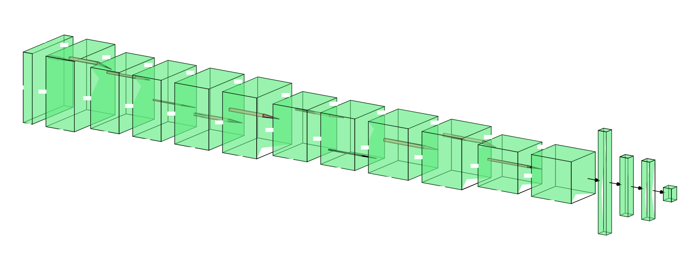

# Yuri

Macro actions based StarCraft AI with Keras

## NN-architecture



## Usage

### Build Running Environment

Install Starcraft II from [official site](http://us.blizzard.com/en-us/%20/games/sc/)

Install python package manager: [pipenv](https://github.com/pypa/pipenv)

```sh
$ pipenv install
```

### Run game

```sh
$ pipenv run python game.py
```

### Train model

```sh
$ pipenv run python train.py
```

## Trainning Data Set

```
https://drive.google.com/file/d/1cO0BmbUhE2HsUC5ttQrLQC_wLTdCn2-u/view?usp=sharing
```