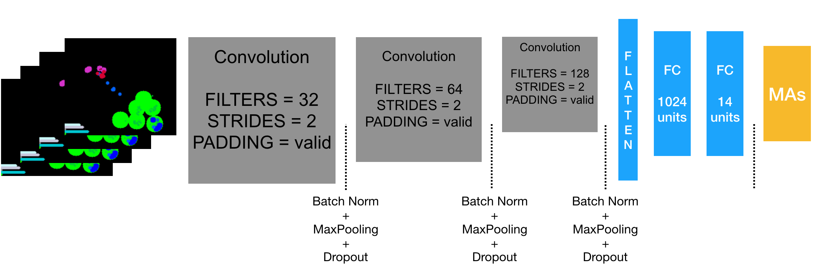

# Yuri

可扩展的 StarCraft II 决策实验室：规则基线、Laya 策略、结构化决策记录与交互式可视化。

**0.2 状态：** 新运行时与官网已实现；真实模型推理和游戏对战尚待实机验收。旧版胜率不适用于新版本。

- [完整开发设计、迁移方案与验收计划](docs/DEVELOPMENT.md)
- 官网与交互演示：<https://tsonglew.github.io/yuri/>
- 环境：WSL Ubuntu / Python 3.12 / uv

## 新版快速开始

在 WSL 项目目录执行：

```bash
uv sync --locked
uv run --locked pytest -q
uv run --locked yuri decide --policy rules \
  --state examples/observation.json --output artifacts/rules.json

# 真实模型首次预热，输出模型 revision、torch / CUDA / 设备信息
uv run --locked --extra laya yuri preflight \
  --state examples/observation.json --budget-ms 120000 \
  --output artifacts/laya-preflight.json

# 检查 status=passed 和 decision.executed_policy=laya
# 后续将 decision.model_revision 设为 YURI_LAYA_REVISION 固定权重

# 实验游戏入口，需先设置 WSL2 连接变量、SC2PATH 并安装地图
export SC2PATH='/mnt/c/Program Files (x86)/Battle.net/StarCraft II'
read -r -p 'Windows 可达的 IPv4 地址: ' SC2CLIENTHOST
export SC2CLIENTHOST SC2SERVERHOST=0.0.0.0
uv run --locked --extra game yuri doctor --map AcropolisLE
uv run --locked --extra game yuri game --policy rules --map AcropolisLE --seed 1

# 两条策略用相同种子配对运行；需要本地地图并启用两种 extra
uv run --locked --extra game --extra laya yuri evaluate \
  --policies rules laya --games-per-policy 10 --seed-start 1 --map AcropolisLE

# 官网预览
python3 scripts/build_site.py
python3 scripts/check_site.py
python3 -m http.server 8765 --directory _site --bind 127.0.0.1
```

浏览器打开 <http://localhost:8765>。官网实时计算规则，并支持导入 JSON / JSONL 决策回放；不在浏览器执行 Laya，不上传导入文件。

新运行时位于 `src/yuri_next`，依赖以 `pyproject.toml` / `uv.lock` 为准。原 main、basebots、models、trainers 和 Pipfile 为历史参考，不再使用旧安装流程。

<details>
<summary>历史版说明（不适用于新入口，胜率未经本次验证）</summary>

Macro actions based toy DQN StarCraft II AIbot, which beats Hard(Level 5) builtin bot with 95% win rate 



## Getting Started

### Prerequisites

* Install Starcraft II from [official site](https://starcraft2.com/en-us/legacy-of-the-void/)
* Install python package manager: [pipenv](https://github.com/pypa/pipenv)
* Download Training data for attack actions and link to `yuri/attack_train`
* Create directory to save random victory data

```sh
$ pipenv install
```

## Running the tests

To-do

### Break down into end to end tests

To-do

### And coding style tests

```
$ pylint *.py
```

## Deployment

### Configuration

Fill configs in `yuri/yuri.json`

### Run game

```sh
$ pipenv run python -m yuri.main --type game 
```

### Train model

```sh
$ pipenv run python -m yuri.main --type train
```

## Built With

* [pipenv](https://github.com/pypa/pipenv)

## License

This project is licensed under the MIT License - see the [LICENSE.md](LICENSE) file for details

## Acknowledgments

To-do

</details>
